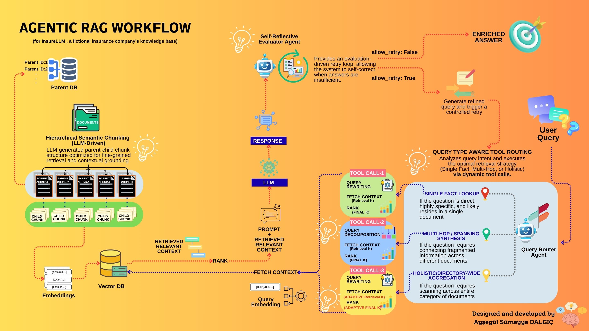
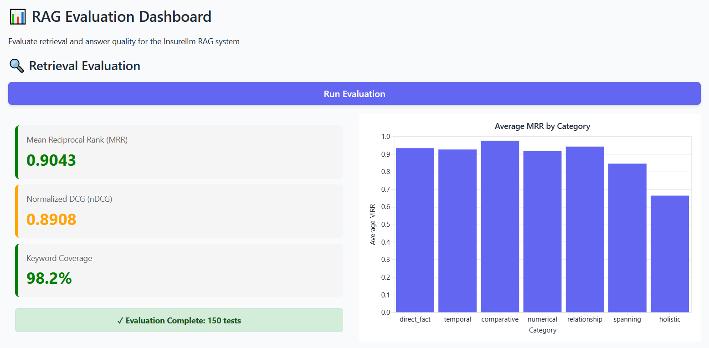
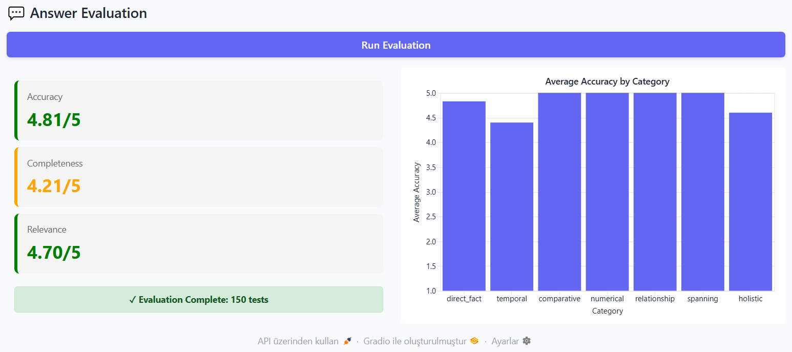

# 🚀 InsureLLM: Advanced Agentic RAG Architecture

An advanced, production-ready Retrieval-Augmented Generation (RAG) system built for a fictional insurance company, InsureLLM. This project goes beyond naive RAG implementations by introducing an **Agentic Workflow** designed to tackle complex, multi-hop, holistic, and numerical queries with high accuracy.

This project was developed as an advanced challenge following the Ed Donner's **"AI Engineer Core Track: LLM Engineering, RAG, QLoRA, Agents"** course on Udemy, successfully outperforming the baseline metrics in the most difficult query categories.

## 🧠 Core Architecture

The system is built on three main pillars that transition standard retrieval into an autonomous, intent-aware pipeline:

### 1. Hierarchical Parent-Child Semantic Chunking
Instead of standard character-based splitting, this pipeline uses an LLM-driven approach to decouple the context layer from the index layer. 
* **Child Chunks:** Highly granular, specific details optimized for exact semantic matching.
* **Parent Chunks:** Broader, context-rich sections fed to the LLM to preserve the full meaning and factual structure.

### 2. Agentic Query Router (Intent-Aware Tool Routing)
An intelligent router that analyzes the intent and complexity of the user query, utilizing **LLM tool calling** to dynamically trigger the optimal retrieval strategy:
* **Single Fact Lookup:** For direct, specific questions residing in a single document.
* **Multi-Hop / Spanning Synthesis:** Decomposes complex queries into sub-queries to connect fragmented information across different sources.
* **Holistic / Directory-Wide Aggregation:** Adaptively adjusts the retrieval breadth (`Retrieval K`) to scan, filter, or aggregate data across entire document categories.

### 3. Self-Reflective Evaluator Agent
A built-in Quality Gate that assesses response quality via an **'LLM-as-a-judge'** approach. It autonomously triggers a retry loop for better context retrieval if the initial answer is inadequate, vague, or missing key facts.

---

## 📊 Evaluation & Metrics

The system was rigorously tested against a comprehensive dataset containing 150 diverse queries (Direct Fact, Temporal, Comparative, Numerical, Relationship, Spanning, Holistic).

By making a conscious architectural trade-off—slightly broadening the retrieval scope to maximize context—the system achieved a massive accuracy boost in the hardest query categories.

### Answer Evaluation (LLM-as-a-Judge)
| Metric |  Ed's Baseline | My Score |
| :--- | :--- | :--- |
| **Overall Accuracy** | **4.62 / 5.00** | **4.81 / 5.00** |
| Overall Relevance | 4.84 / 5.00 | 4.70 / 5.00 |
| Overall Completeness | 4.35 / 5.00 | 4.21 / 5.00 |

🏆 **Major Improvements Over Baseline:**
* **Numerical Queries:** 5.0 / 5.0 (vs. baseline 3.8)
* **Spanning Queries:** 5.0 / 5.0 (vs. baseline 4.4)
* **Holistic Queries:** 4.6 / 5.0 (vs. baseline 3.5)

### Retrieval Evaluation
* **Keyword Coverage:** 98.2%
* **Mean Reciprocal Rank (MRR):** 0.9043
* **Normalized DCG (nDCG):** 0.8908

*(A visual dashboard of these metrics built with Gradio can be generated using the evaluation scripts).*

---

## 📂 Project Structure

* `implementation/ingest.py`: Generative data pre-processing and hierarchical vector database construction.
* `implementation/answer.py`: The core Agentic RAG logic including the Query Router and Self-Reflective Evaluator.
* `evaluation/eval.py`: Scripts to calculate MRR, nDCG, and LLM-as-a-judge scores.
* `evaluator.py`: A Gradio-based UI dashboard to visualize evaluation metrics.
* `knowledge-base/`: Raw markdown data for the fictional company. (Not uploaded to respect the IP of Ed Donner's Udemy course.  
                     Please refer to the original course materials if you wish to run this pipeline locally.)
---

## 🚀 Getting Started

### Prerequisites
* Python 3.12+
* ChromaDB
* OpenAI API Key (or LiteLLM supported providers)

### Installation & Execution
1. Clone the repository and install requirements.
2. Create a `.env` file in the root directory and add your API keys.
3. **Build the Vector DB:**
   Run `python implementation/ingest.py` to trigger the LLM-driven semantic chunking and create the local ChromaDB.
4. **Run Evaluations:**
   Run `python evaluator.py` to launch the Gradio dashboard and run the comprehensive test suite.

---
*Designed and implemented as an advanced engineering challenge to push the boundaries of standard RAG systems.*